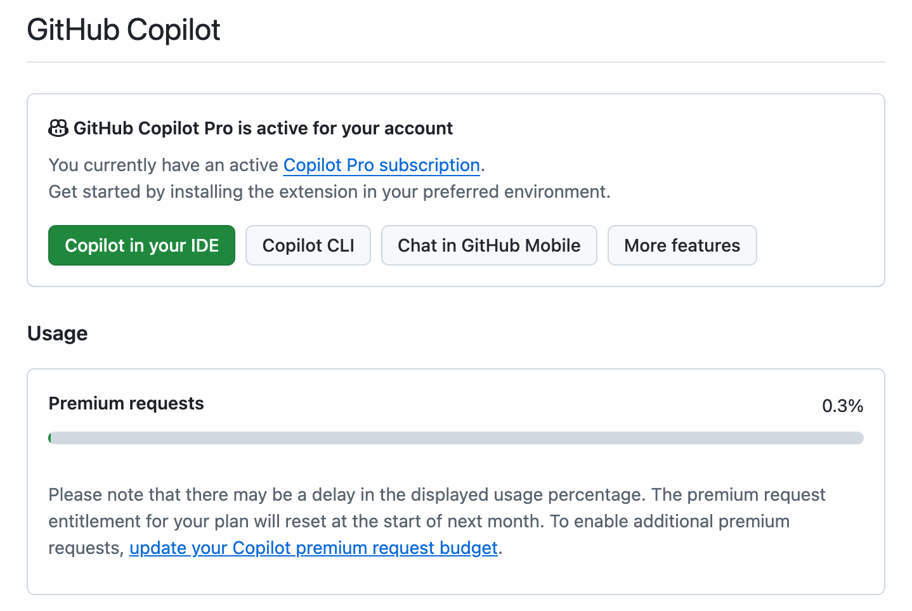
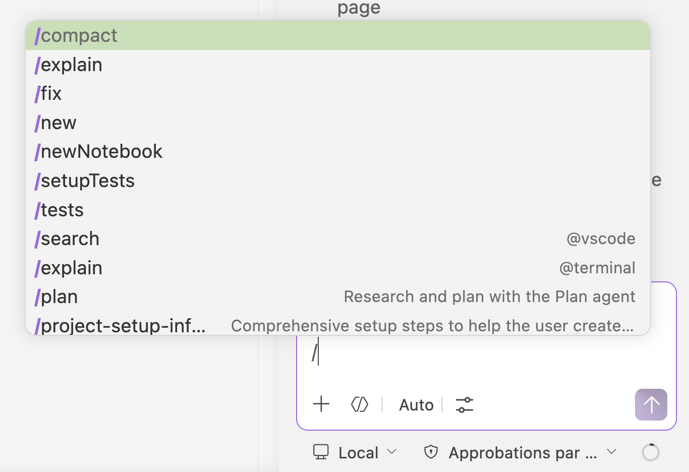
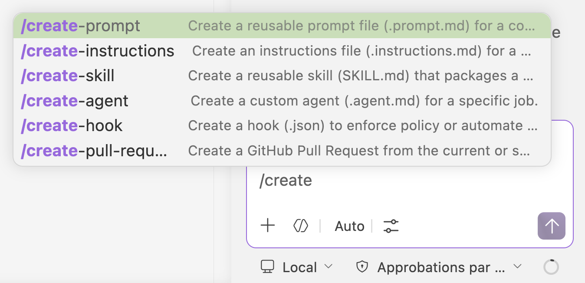
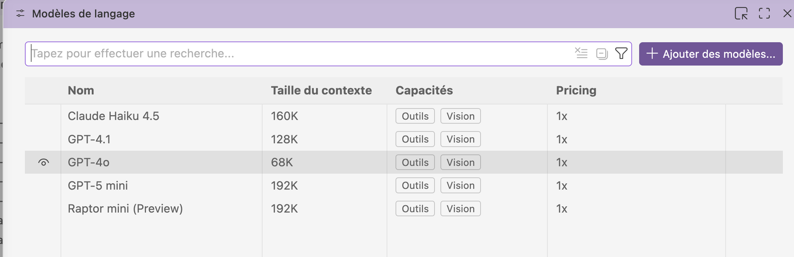
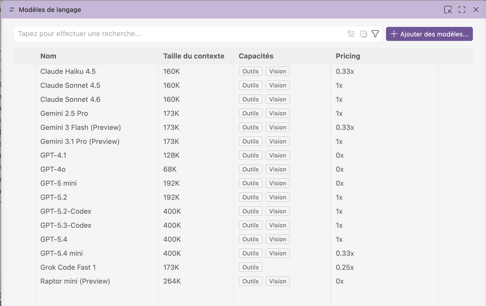

## GitHub Copilot

Github Copilot comporte une version **"Free"** (gratuite). Elle est limitée, voici [les quotas](https://docs.github.com/en/copilot/concepts/billing/individual-plans) valables en mai 2026:

- 2,000 inline suggestions in IDEs per month
- 50 premium requests per month

Les étudiants ayant vérifié leur statut peuvent accéder à **"Copilot Student"**.

Les enseignants peuvent obtenir un accès gratuit à **Copilot Pro**: "A free subscription for GitHub Copilot Pro is available to verified teachers with GitHub Education."

Pour ces deux plans, Student et Pro, la limite de "premium requests" passe à **300 par mois**.

## Historique des évolutions

Le 12 mars 2026, [Github a annoncé](https://github.com/orgs/community/discussions/189268) des changements importants dans leur modèle pour l'éducation. 

Suite à ces changements, les plans Student n'ont plus accès aux modèles premium, "GPT-5.3-Codex, GPT-5.4, and Claude Opus and Sonnet models".

## Activer les "education benefits"

Si votre statut étudiant ou enseignant validé, Github Copilot reste dans la version "Free" tant que  vous n'avez pas activé l'upgrade. Voici la procédure:

- Accéder à son [profil > settings > education benefits](https://github.com/settings/education/benefits)
- Si le statut étudiant a été validé, cela indiquera: "*To redeem Copilot, please sign up via this link*". Le lien envoie vers une [page d'activation](https://github.com/github-copilot/free_signup)

Une fois validé, on a accès à la version étendue de Copilot.

On peut vérifier les réglages, et sa consommation de requêtes, dans son [profil utilisateur > Copilot Features](https://github.com/settings/copilot/features)

## Conseils d'utilisation

À documenter...

Lire: 

- [About Custom Agents](https://docs.github.com/en/copilot/concepts/agents/cloud-agent/about-custom-agents)

Modèles disponibles dans Copilot Free:

Sur le plan Free, tout modèle consomme 1 requête premium. Donc pas de différence de coût entre les modèles sur Free.

Modèles disponibles dans Copilot Pro:

Dans Copilot Pro, les modèles GPT-4.1, GPT-4o et GPT-5 mini sont gratuits (aucune consommation de requêtes).

## Les 5 modèles décryptés (selon Claude.ai)

Source: [AI model comparison](https://docs.github.com/en/copilot/reference/ai-models/model-comparison) 

### 🟢 GPT-4.1 — Le généraliste fiable

Si tu n'es pas sûr de quel modèle utiliser, GitHub recommande de commencer par **GPT-4.1**, puis d'ajuster selon tes besoins. C'est le couteau suisse : bon équilibre vitesse/qualité, idéal pour la majorité des tâches quotidiennes (complétion, refactoring simple, génération de code, documentation).

**Utilise-le pour :** tout ce qui est courant — complétion de code, questions rapides, génération de boilerplate.

