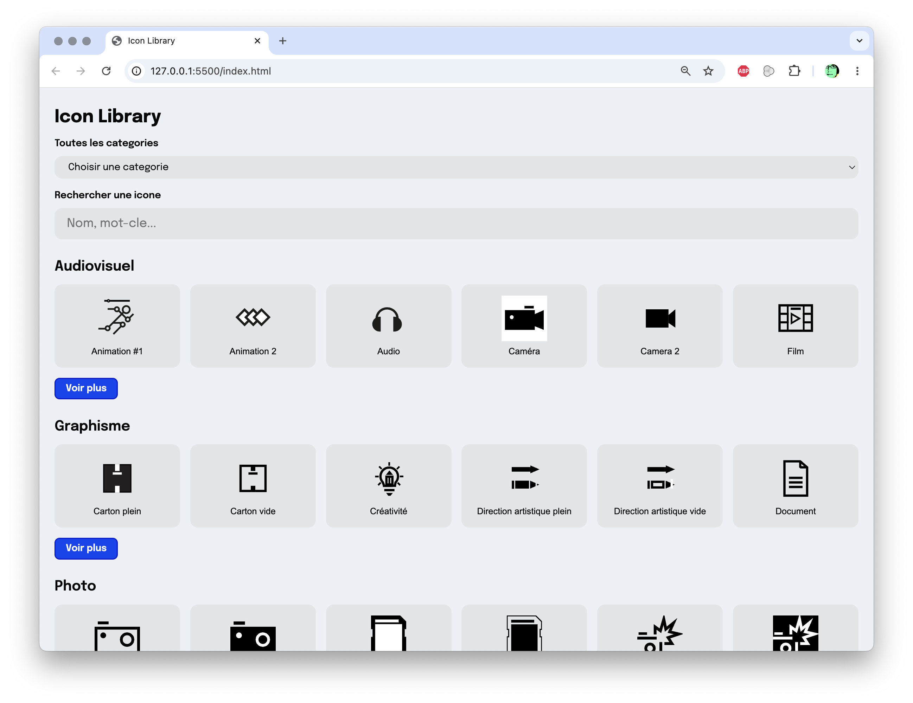
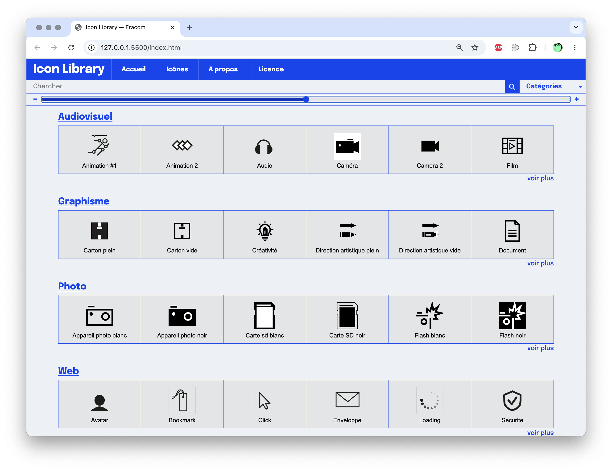
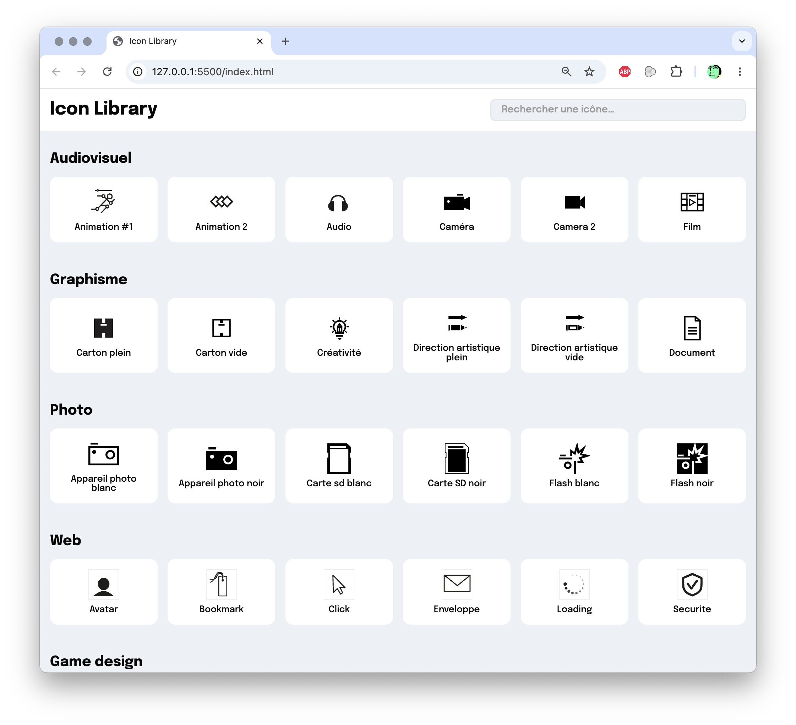

## GitHub Copilot Demo

Voici une petite démonstration, dans laquelle on crée l'ébauche d'un site web avec Github Copilot. On utilise le modèle IA GPT-4.1, un modèle généraliste disponible dans Copilot Free.

<iframe width="100%" style="ratio:16/9; min-height:320px" src="https://www.youtube-nocookie.com/embed/gWo6xff5l0s?si=VSlrYxW4gp5J3tK3" title="YouTube video player" frameborder="0" allow="accelerometer; autoplay; clipboard-write; encrypted-media; gyroscope; picture-in-picture; web-share" referrerpolicy="strict-origin-when-cross-origin" allowfullscreen></iframe>

---

### Versions par différents modèles

À partir des mêmes indications intiales, trois versions ont été créées en interaction avec différents modèles IA.

1) Un premier jet rapide, par Copilot Pro et GPT 5.3 Codex (un modèle premium de OpenAI). Voir la branche de code [ms-copilot](https://github.com/Eracom-ID441/index-picto/tree/ms-copilot).

2) Une version par Copilot et GPT-4.1 (modèle généraliste de OpenAI). Voir la branche de code [copilot-GPT-4.1](https://github.com/Eracom-ID441/index-picto/tree/copilot-GPT-4.1).

3) Une version par [OpenCode](https://opencode.ai/) avec le modèle gratuit BigPickle (GLM 4.5). Voir la branche de code [opencode-bigpickle](https://github.com/Eracom-ID441/index-picto/tree/opencode-bigpickle).

