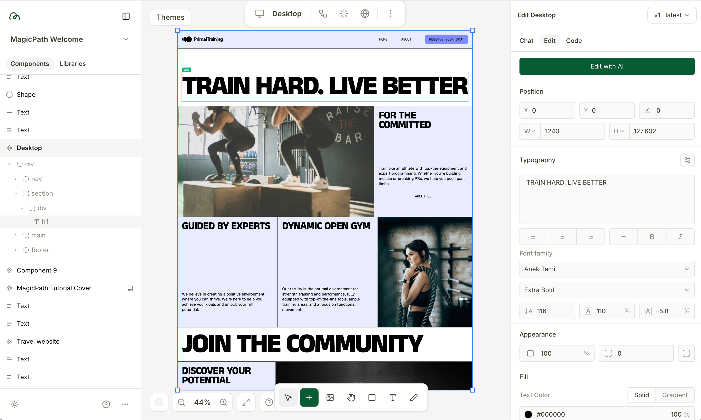

Outils utilisant l'IA.

## Génération d'images

**Recraft** : [www.recraft.ai](https://www.recraft.ai/)  - Possède un mode gratuit limité (30 credits, renewed daily). [Exemple](https://www.recraft.ai/community?imageId=ff989526-3813-4531-a45b-0b167eabbe13).

**Ideogram** : [ideogram.ai](https://ideogram.ai/)

Autres: Nano Banana, Flux, Higgsfield, Stable Diffusion, etc

"The professional workflow of 2025 is a hybrid one, where the orchestrator—not just the prompter—wins. You might use **Midjourney** for concept art, **Sora 2** for narrative plates, **Wan Alpha** for VFX elements, and **Runway** to track it all together in a 3D environment". ([source](https://chasejarvis.com/blog/google-veo-3/))

## Video generator

Veo, Kling, Runway, WAN, and more

Google Veo 3

**Runway** : [runwayml.com](https://runwayml.com/)

**[Higgsfield](https://higgsfield.ai/)** : une plateforme multimédia générative, développée par le département IA de Snapchat, qui permet de créer des vidéos cinématographiques courtes.

## Outils génératifs de design

Outils d'idéation et "Vibe Design".

**MagicPath** : [www.magicpath.ai](https://www.magicpath.ai/) - "Cursor for design—a canvas‑first workflow". Peut exporter du code React.

**Relume** : [www.relume.io](https://www.relume.io/) - outil pouvant produire des Sitemaps, Wireframes et Style Guides. Les designs peuvent être exportés vers Figma, Webflow ou React.

## Génération d'applications web

Outils de "Vibe Coding" permettant de produire des sites web: 

**Figma Make**

Lovable, Replit, v0 et Bolt.

**[Floot](https://floot.com/)** : utilisé par [Etienne Mineur](pionniers.html).

**Dazl** : "an AI-powered app builder that transforms ideas into functional applications". [dazl.dev](https://dazl.dev/)

## Workflows AI

Des outils fonctionnant avec un "Node graph"

**Weavy** : [www.weavy.ai](https://www.weavy.ai/) "Turn your creative vision into scalable workflows. Access all AI models and professional editing tools in one node based platform." - propose un plan gratuit. - A été [acquis par Figma](https://www.figma.com/blog/welcome-weavy-to-figma/) en octobre 2025. "High control, wide-ranging features, learning curve but manageable." Voir [tutoriel vidéo](https://www.youtube.com/watch?v=ihOFi5lpQr8). – Voir [vidéo présentant un workflow complet](https://youtu.be/AxV8TR3BdqI?si=UbYsVLjDrMQALnMu&t=2442).

**Flora AI** : "Mid-tier control, stripped down offering of features, a lower learning curve." Essai gratuit avec 1000 starter credits.

"If you want fast production without the headaches → Flora/Weavy."

**Scade Pro** : [www.scade.pro](https://www.scade.pro/) - permet de mettre en réseau différentes AI. "Register at Scade.pro and gain access to over 1,500 AI models with intuitive drag-and-drop flow builder." "We offer over 1500 AI models for you to explore. From popular ones like ChatGPT and Stable Diffusion to our own LoRa models, we've got a wide range of AI needs covered."

**ComfyUI** : [https://www.comfy.org/](www.comfy.org). "Full control, tons of features, high learning curve." "If you want maximum flexibility → ComfyUI." "Most marketing teams don’t actually need Comfy unless they’re doing very experimental or highly custom visual work. For day-to-day creative output, the simpler tools usually cover 90% of needs."

## Réflexions et liens

[Une vidéo de Dylan Field](https://x.com/zoink/status/1972708411423989794), fondateur de Figma.
