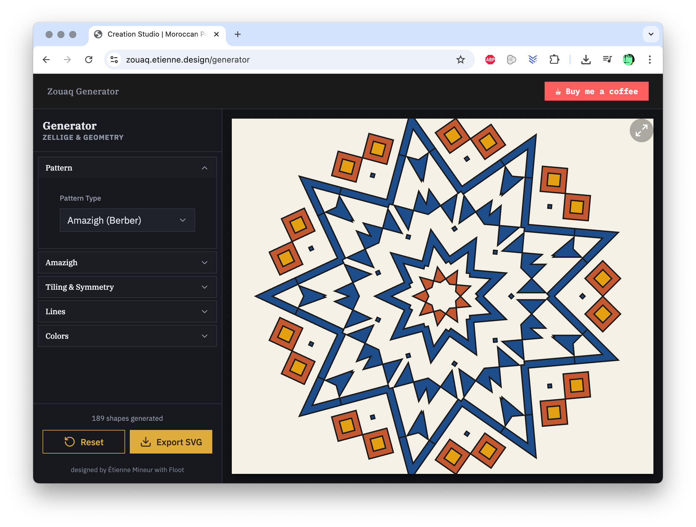
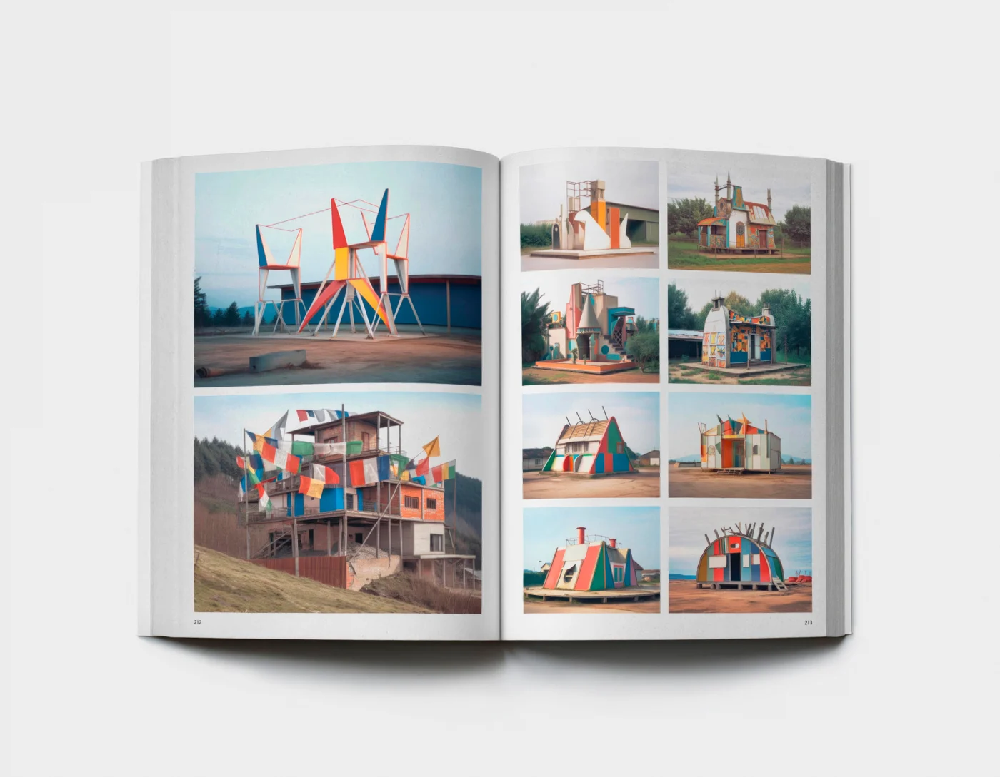

Figures pionnières dans l'utilisation créative de l'IA.

[DeepDream](https://fr.wikipedia.org/wiki/DeepDream) : logiciel développé en 2014, utilisant un réseau neuronal, produisant des images psychédéliques.

## Etienne Mineur

Né en 1968, designer, éditeur et enseignant français, dont le travail est axé sur les relations entre graphisme et interactivité.Connu pour son projet Editions Volumiques. Travaille avec les IA sur de nombreux projets depuis 2022.

> Personnellement, l'IA m'a provoqué deux véritables chocs. Le premier lors de la découverte de l'Alpha de Midjourney sur Discord, où j'ai entrevu le bouleversement qui nous attendait. Le second en septembre 2025, lorsque le vibe coding a enfin tenu ses promesses et commencé à fonctionner concrètement pour moi.

En février 2026, il donne accès à trois outils IA qu'il a développé (en Vibe Coding): 

- [tissagestudio.etienne.design](https://tissagestudio.etienne.design/) - outil de génération de trames graphiques. [Voir tutoriel](https://www.linkedin.com/posts/etiennemineur_voici-un-tutoriel-qui-explique-bri%C3%A8vement-activity-7401878015795744768-Tk9_).

- [https://proceduralstudio.etienne.design/](https://proceduralstudio.etienne.design/) - outil proposant plus de 300 animations procédurales entièrement paramétrables et combinables entre elles (disponibles dans l’onglet «Compositor»). «vous pouvez vous amuser à refaire des démos vidéos dignes des DemoMakers des années 80 sur Commodore 64 ou Amiga !»

- [zouaq.etienne.design](https://zouaq.etienne.design/) - "Create authentic Zellige and Zouaq patterns with the mathematical precision of the Hasba method. Export your creations as SVG for your design projects." Créé avec [Floot](https://floot.com/).

Écrits: 

- *[Réflexions provisoires liées aux intelligences artificielles](https://etienne.design/2022/02/16/ai-3/)*, février 2022
- [«Intelligences» artificielles et design dans les écoles en 2022](https://etienne.design/2022/09/27/ai-2/), septembre 2022
- Sylvain Menétrey et Etienne Mineur, *«[L’automatisation pour ou contre les designers](https://www.hesge.ch/head/issue/publications/lautomatisation-ou-contre-les-designers-sylvain-menetrey-etienne-mineur)»*, Issue, décembre 2022
- *[Après quatre mois de workshops dans les écoles de design utilisant les intelligences artificielles!](https://etienne.design/2023/01/27/ai-2-ecole/)*, janvier 2023
- *[L’IAG est une sorte de bandit manchot - Entretien avec Étienne Mineur](https://www.unilim.fr/interfaces-numeriques/5570)*, Interfaces Numériques, octobre 2025

## Eric Tabuchi – The Third Atlas

Un livre entièrement [composé d'images générées par IA avec Midjourney](https://fisheyemagazine.fr/article/eric-tabuchi-the-third-atlas-ou-la-mecanique-des-reves/) par le photographe Eric Tabuchi, offrant une perspective innovante sur la photographie.

Écrits: 

- *[Eric Tabuchi : The Third Atlas, ou la mécanique des rêves](https://fisheyemagazine.fr/article/eric-tabuchi-the-third-atlas-ou-la-mecanique-des-reves/)*, Fisheye, 2024.